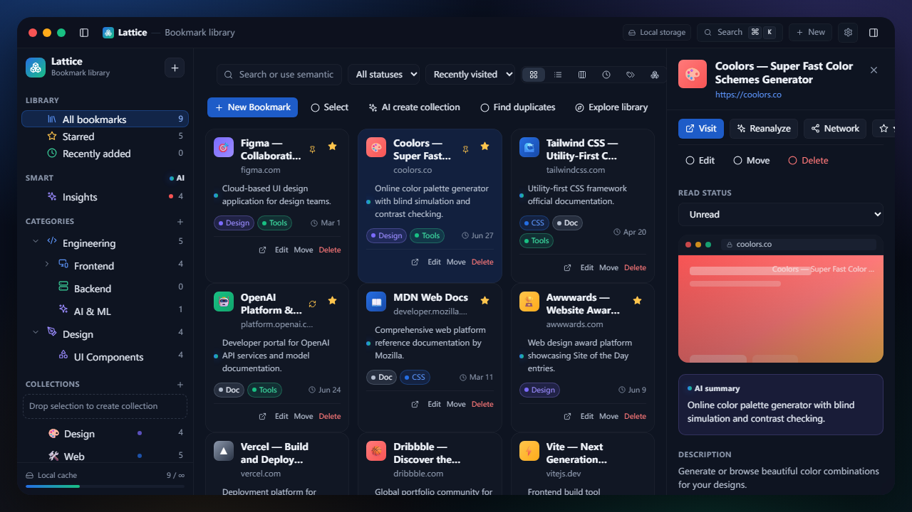
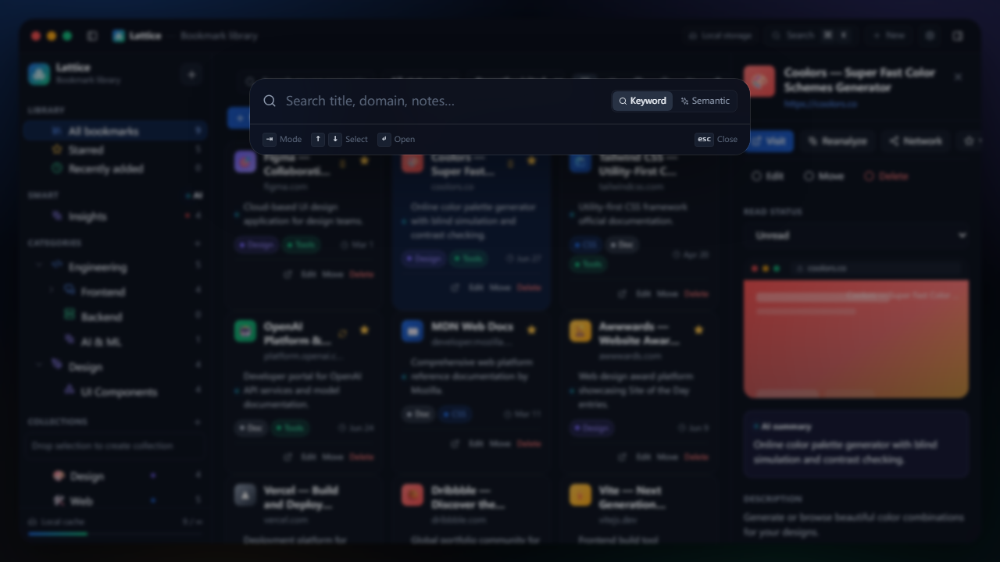
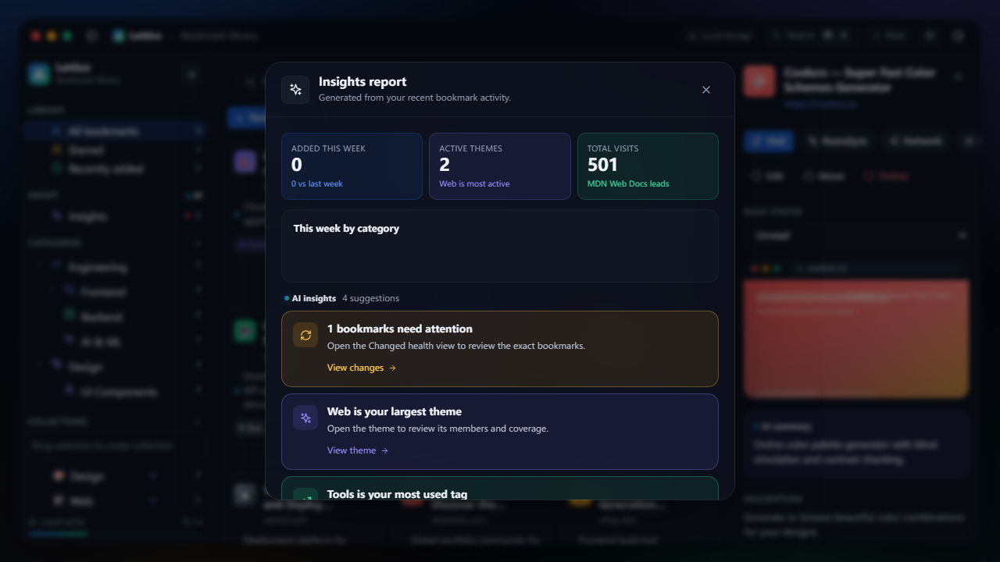
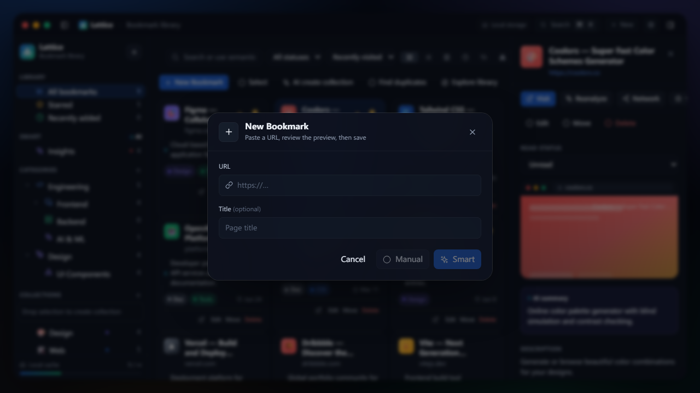
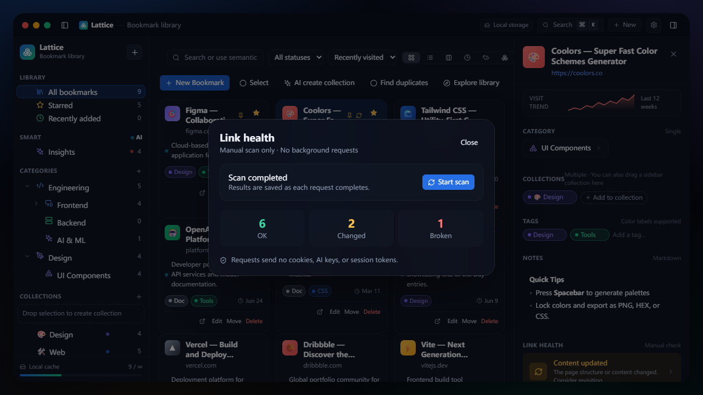
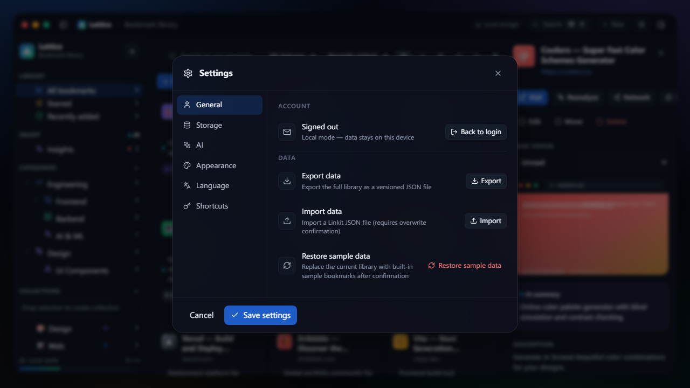

# Linkit - 智能知识收藏空间

<p align="center">
  
</p>

<p align="center">
  <a href="README.md">English</a> | <b>简体中文</b>
</p>

---

**Linkit** 是一款桌面端的「智能知识收藏空间」，用于网址、网页资源与灵感素材的收集、整理、发现与再利用。它不同于传统的浏览器收藏夹：分类用于长期稳定整理，主题用于跨分类的创意组合，而 AI 则是你的个人智囊，帮助你深度理解、连接与整理所有收藏资产。

### 🌟 核心特性

- **💡 知识资产化管理**：不仅仅是保存网址，还支持自定义标签、星标、置顶、图文备注和阅读状态（`未读`、`在读`、`已读`、`已归档`）等多维度属性。
- **📁 多级分类树**：稳定清晰的分类层级架构，支持通过拖拽节点调整父子关系，以及将书签拖入分类完成快速归类。
- **🎨 创意主题空间**：跨分类的主题整理模块，支持自定义 Emoji 和主题配色。你可以通过手动拖入书签或通过 AI 语音/文字指令智能构建主题。
- **🤖 内置 AI 助手**：本地或云端大模型深度赋能，可对入库网页进行自动抓取、智能摘要、推荐标签与分类、生成知识洞察、去重合并建议以及全库语义搜索。
- **🔍 Spotlight 闪念搜索**：使用 `Cmd/Ctrl + K` 随时唤起，支持全文及语义向量检索，还可以将剪贴板的链接一键快捷入库。
- **🛡️ 安全的双模式存储**：支持离线优先的本地模式，以及基于 Supabase 的云同步模式。开启云同步时，所有数据通过 Supabase Row-Level Security (RLS) 行级安全策略进行隔离保护，确保数据仅本人可读写。
- **❤️ 链接健康与洞察报告**：定期在后台扫描，发现失效或内容更新的链接；定期生成收藏洞察，帮助你消化已收藏的干货。
- **🌐 静态知识网络**：可视化呈现知识网络图谱，节点之间以共同标签、主题或 AI 语义关联，点击即可在视图中跳转。

---

### 📸 界面展示

#### 📊 桌面工作空间 (Dashboard)
精美的三栏式布局，包含可折叠的导航栏与详情面板，支持卡片、列表、瀑布流、时间流、标签聚合和主题空间等六种灵活视图。


#### 🔍 Spotlight 快速搜索 (`Cmd/Ctrl + K`)
随时随地唤起，秒级进行多属性匹配和语义级搜索，或直接粘贴 URL 自动完成入库。


#### 🤖 AI 智能洞察与摘要
大模型一键提取网页的核心看点，自动提炼标签，并生成简明易读的摘要。


#### 📥 捕获与入库分析
简易 of URL 输入与拖拽入库机制，AI 实时并发抓取并生成标签推荐。


#### 💔 链接健康扫描
智能扫描死链，标记出 `失效 (broken)` 与 `内容变更 (changed)`，方便定期清理。


#### ⚙️ 系统偏好与精美主题
支持多款优雅的现代感界面皮肤（*Midnight*, *Ocean*, *Graphite*, *Sunset*）和中英双语界面一键无缝切换。


---

### 🛠️ 技术栈

- **桌面框架**：[Wails](https://wails.io/) (Go / Golang)
- **前端核心**：[React](https://react.dev/) + [Vite](https://vite.dev/) + [TypeScript](https://www.typescriptlang.org/)
- **页面样式**：[Tailwind CSS](https://tailwindcss.com/) + 高级毛玻璃微动效设计
- **数据库与服务**：[Supabase](https://supabase.com/) (PostgreSQL & 行级安全策略)
- **状态管理**：React Context + 自定义 Hooks
- **AI 引擎**：兼容本地及 OpenAI/DeepSeek 等标准 API 协议的大模型后端

---

### 🚀 安装与快速开始

#### 🍺 推荐方式：macOS Homebrew 安装

通过第三方 Homebrew Tap 一键安装通用 (Universal) macOS 应用：

```bash
brew install blue-idea/tap/linkit
```

随时升级至最新版本：

```bash
brew upgrade linkit
```

> **注意**：Linkit 当前尚未进行 Apple 官方签名公证。第三方 Cask 会在安装完成后自动移除 `Linkit.app` 的 Gatekeeper `com.apple.quarantine` 隔离属性，无需 `sudo` 权限，也不会修改系统其他应用。

#### 📦 预编译二进制下载
包含 Windows、macOS (DMG) 和 Linux (AppImage / DEB) 的最新预编译版本均可在 [GitHub Releases](https://github.com/blue-idea/linkit/releases) 页面直接下载。

> **macOS DMG 用户提示**：DMG 安装包内置了一键修复脚本 `Fix Gatekeeper.command`。如果在 macOS 上提示“无法验证开发者”或无法打开，只需先将 `Linkit.app` 拖入 `Applications` 文件夹，再双击运行 DMG 内的 `Fix Gatekeeper.command` 脚本，即可自动清除 Gatekeeper 隔离属性。

---

### 🛠️ 源码构建 (开发者指南)

#### 开发前置要求
- [Go 语言](https://go.dev/) (推荐 v1.26.0+)
- [Node.js](https://nodejs.org/) (v18+) 及 [pnpm](https://pnpm.io/)
- [Wails CLI](https://wails.io/docs/gettingstarted/installation) (v2.13.0+)

#### 1. 克隆项目并安装依赖
```bash
git clone https://github.com/blue-idea/collection.git
cd collection
pnpm --prefix ui install --frozen-lockfile
```

#### 2. 配置环境变量
复制 `.env.test.example` 为 `.env` 并填写您的 Supabase 连接密钥或本地 AI 密钥配置：
```bash
cp ui/.env.test.example ui/.env
```

#### 3. 运行开发环境
使用**开发身份**启动 Wails，使 AppData / Keychain 使用 `Linkit-Dev`，与正式安装隔离：
```bash
# Windows
./scripts/dev.ps1

# macOS / Linux
./scripts/dev.sh
```
等价命令：`wails dev -tags dev`。若同一台机器还要验证 Release 安装包，请勿日常使用不带 `-tags dev` 的 `wails dev`。

*如果只需开发前端 React 原型界面：*
```bash
cd ui && pnpm dev
```
然后在浏览器中访问 `http://localhost:5173/`。

#### 4. 打包发布应用
正式构建**不要**加 `dev` tag，产物使用干净的 `Linkit` 身份槽：
```bash
wails build
```
输出的可执行文件将会保存在 `build/bin/` 目录下。

---

### 🔑 隐私安全与数据保护
- **行级安全 (RLS)**：云端同步基于 Supabase 原生 RLS 构建，用户的每一行数据记录在物理层面严格与 `auth.uid()` 绑定，防范任何数据越权访问。
- **密钥安全**：所有的 AI API 密钥与第三方凭证都通过宿主系统的安全凭据层（使用 `go-keyring`，如 macOS Keychain 或 Windows Credential Manager）进行本地存取，绝对不会被上传或硬编码在代码中。
